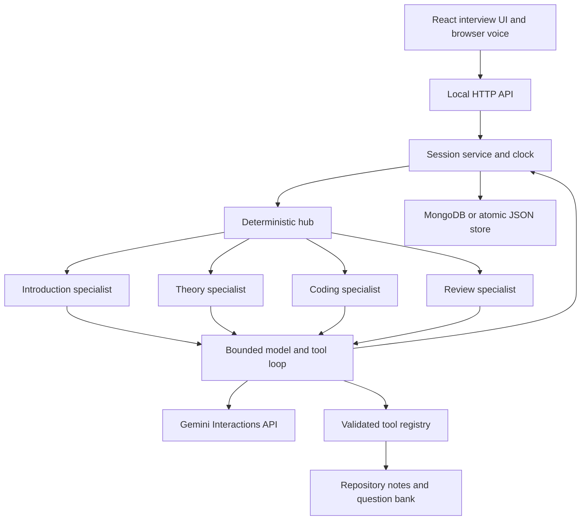
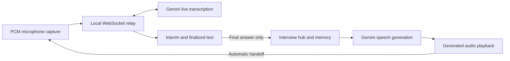

# Interviewer agent — setup and architecture

Short-Notes ka live interviewer selected subject par one-hour practice session chalata hai: introduction, project follow-ups, theory, machine coding, and an evidence-based review. Open `/interview/live` from the app. Existing notes and self-review practice remain available without the AI backend.

## Local setup

Node.js 22.12+ and a Gemini API key are required. From the repository root, copy `.env.example` to `.env` only if you do not already have a `.env` file. Fill these server-only settings:

```dotenv
GEMINI_API_KEY=your_key_here
GEMINI_MODEL=gemini-3.5-flash-lite
INTERVIEW_PORT=8787
```

Never add the real key to Git, frontend source, or a `VITE_*` variable. The root `.env` and `.interviews/` are ignored by Git and blocked from Vite file serving. Restart the backend after changing environment settings. Model availability and quota depend on your Gemini project.

```sh
npm ci --prefix server
cd playground
npm ci
npm run dev:agent
```

The combined command starts Vite at `http://127.0.0.1:5173` and the API on loopback port 8787 (or `INTERVIEW_PORT`). Visit `http://127.0.0.1:5173/interview/live`. Vite proxies `/api/interviewer` to the backend. `npm run server` starts the API alone; `npm run dev` starts the existing frontend alone. Production preview also proxies API requests, so the API must be running separately when using `npm run preview`.

## Interview flow

| Active interview time | Specialist | Responsibility |
| --- | --- | --- |
| 0–5 minutes | Introduction | Ask about the candidate, projects, personal contributions, and implementation choices |
| 5–30 minutes | Theory | Retrieve subject questions, examine reasoning, correct misconceptions, and follow up |
| 30–55 minutes | Coding | Assign one subject task, narrow the requirements to fit, give progressive hints, and review submitted code |
| 55–60 minutes | Review | Summarize observed strengths, gaps, hints used, and relevant chapters |

Pause excludes paused time from the interview clock. Reload restores the session and browser drafts; an active interview continues to consume time while the page is closed, so pause before leaving. The server controls phase progression and the elapsed-time limit. Manual next-round actions only move forward. Ending early requests the review.

Voice uses server-side Gemini tools: `gemini-3.5-transcribe-live` streams live captions in Automatic voice, `gemini-3.5-transcribe` handles manual recordings, and `gemini-3.8-flash-lite-tts` speaks replies. Browser APIs only capture and play audio; there is no browser speech-recognition or speech-synthesis fallback. Audio goes to Gemini through the local server and is never stored in interview storage.

Automatic voice is on by default. Start interview requests microphone permission and prepares playback. Each spoken reply hands over to the mic after a short echo gap. Captions update while the candidate speaks; 2, 3.5, 5, or 7 seconds of silence (default 3.5) finalizes and submits the answer. Interim hypotheses never submit. Coding dictation opens automatically but requires explicit Send & review code. Stop mic finalizes for review; Pause voice, Escape, hidden tabs, and errors stop capture until resumed. This is an alternating interview conversation with live input captions, not full-duplex speech-to-speech or voice-triggered interruption.

In theory and coding, the optional inactivity helper offers a hint after roughly 90 seconds without activity; the learner chooses whether to request it. Hints are counted separately and are not graded as answers.

Coding tasks cover all selectable subjects, including a supplemental React Native task. The agent reviews submitted code as text. It cannot execute code, access a terminal, or prove that tests pass. Run solutions locally and share actual results when needed. Feedback is model-generated practice guidance, not a guaranteed correctness judgment.

## Hub and specialist architecture



The hub selects one specialist for the server-owned phase. Specialists are separate roles using the same provider, each with its own prompt, tool permissions, messages, and assessments. They are invoked one at a time; they do not run as autonomous background processes or communicate directly with each other.

Each session stores `agentMemory.intro`, `.theory`, `.coding`, and `.review`. A specialist receives only its own recent conversation plus hub-selected shared context: the introduction dossier, selected subject, task, observed assessments, prior progress, and bounded handoffs. A handoff carries the previous specialist's latest exchange and assessed topics. This deliberate sharing supports continuity; separate memories are an application boundary, not separate security tenants.

A turn follows this sequence:

1. The API validates the request and the session service acquires a per-session in-process lock.
2. The service clones saved state and computes the phase; the hub selects its specialist.
3. The hub prepares small subject-scoped note/question excerpts for theory and coding using the existing read-only tools. The runtime sends shared rules, only the active specialist's instructions, bounded context, and permitted tool schemas to Gemini. Introduction skips technical learner-memory retrieval and receives its own history without a duplicate dossier.
4. When more evidence or a coding assignment is needed, the model requests a tool; the server validates its arguments and permissions, executes it, and returns the result. Sufficient prepared evidence allows a direct response without a retrieval round trip.
5. The loop repeats until a valid `respond` call produces the candidate-facing answer.
6. The service appends messages and any assessment to the selected specialist's memory, then atomically saves the whole session.

Failures before persistence leave the saved transcript, assignments, hint count, and request IDs unchanged. The client preserves the draft and reuses its request ID for retries. Successful request IDs are retained in a bounded window to prevent duplicate committed turns.

## Provider and tools

`server/providers/gemini.mjs` adapts the Gemini Interactions API to the internal model-call contract. The default model is `gemini-3.5-flash-lite`. Requests use `store: false`; application session state lives in the configured storage rather than depending on provider conversation IDs. Full provider steps and signatures are preserved within tool continuations. Stateless requests still send the selected context to Gemini; `store: false` is not a claim that no provider processing or policy-based retention occurs. See [Interactions API](https://ai.google.dev/gemini-api/docs/interactions-overview).

Reasoning model fallback is configured with `GEMINI_FALLBACK_MODELS`, an ordered comma-separated list of at most two alternatives. The local configuration uses `gemini-3.8-flash → gemini-3.7-flash → gemini-3.5-flash-lite`. An empty list disables switching. `server/providers/model-routing.mjs` tries the next model on a provider quota/rate error (HTTP 429) or an explicit upstream availability response (HTTP 502/503/504). Authentication, validation, blocked output, malformed responses, network failures and arbitrary application errors do not trigger model switching. With a usable backup, availability errors switch immediately; without one, a single same-model availability retry remains bounded by the shared deadline. `availability.mjs` provides a short 30-second default cooldown, or a bounded Retry-After delay. This is distinct from quota cooldowns.

`server/providers/quota.mjs` reads at most 64 KiB of upstream quota metadata, retaining only numeric cooldown information and a daily-limit flag. It respects longer Retry-After / RetryInfo waits; otherwise it uses a 60-second cooldown. An explicitly identified daily quota waits until midnight Pacific, including daylight-saving changes. Cooldowns are in process memory and reset on server restart; they are not an authoritative quota counter. They prevent repeated calls to an exhausted model. If every configured model is quota-limited, the API returns a sanitized 429 plus Retry-After and keeps the user's draft. If availability failures are also involved, it returns 503 plus Retry-After instead. There is no unlimited retry loop, automatic billing upgrade, key rotation, or project switching.

`server/agent/routed-turn.mjs` pins the model for each complete tool-loop attempt. If quota or provider availability fails midway, a fallback rebuilds its input from the original session and discards tentative tools and model signatures from the failed attempt. Only the successful attempt contributes coding assignments, feedback, and memory to the atomic session save. Every attempt shares the same 90-second deadline, six model rounds, and twelve executed-tool budget. Traces record the selected model and attempted/cooling models; the UI displays when the latest answer used a backup model. Speech generation and live transcription still use their own dedicated models and quotas.

Gemini limits are project-scoped, not per API key, and vary by model/tier. A different model helps only if it has available quota; a shared project limit can still stop the chain. Daily request quotas reset at midnight Pacific. Check the project's current limits in [AI Studio](https://aistudio.google.com/usage?timeRange=last-28-days&tab=rate-limit), rather than hardcoding a free-tier allowance. [Official quota guide](https://ai.google.dev/gemini-api/docs/rate-limits).

The model proposes function calls; our runtime executes permitted tools. See [Gemini function calling](https://ai.google.dev/gemini-api/docs/function-calling).

| Tool | Allowed roles | Server policy |
| --- | --- | --- |
| `search_notes` | All specialists | Search only the selected subject and return bounded chapter content |
| `get_questions` | Theory, coding | Retrieve selected-subject theory or machine-coding questions |
| `assign_coding` | Coding | Assign an existing selected-subject coding task once |
| `respond` | All specialists | Validate reply, speech, optional assessment, and chapter references |

Tools do not expose arbitrary file access, network requests, shell commands, or code execution. Notes, learner answers, and submitted code are treated as data rather than trusted instructions. Tool validation and server-controlled phases enforce the concrete boundaries; prompts alone cannot guarantee resistance to every model mistake.

## Folder responsibilities

| Path | Responsibility |
| --- | --- |
| `playground/src/interviewer/` | Setup, conversation, code editor, review, API client, voice, controller, and draft storage |
| `server/index.mjs`, `config.mjs`, `dev.mjs` | Startup, root environment settings, and combined local development |
| `server/api/http.mjs` | HTTP routes, allowed hosts/origins, payload limits, and request throttling |
| `server/agent/hub.mjs`, `specialists.mjs` | Phase-based delegation and specialist definitions |
| `server/agent/runtime.mjs`, `context.mjs`, `prepare-context.mjs` | Model/tool loop, bounded context, read-only evidence preparation, and operational traces |
| `server/agent/guardrails.mjs`, `schemas.mjs` | Input/output validation, tool schemas, and budgets |
| `server/agent/prompts/` | Shared interviewer rules and each specialist's role instructions |
| `server/providers/` | Provider transport and response adaptation |
| `server/tools/` | Tool dispatch, knowledge retrieval, and coding assignment |
| `server/knowledge/` | Repository content loading, search, and supplemental coding tasks |
| `server/sessions/` | Session lifecycle, timing, retries, locking, and public session projection |
| `server/storage/` | JSON persistence adapter |
| `playground/tests/interviewer*.test.mjs` | Deterministic backend and UI behavior tests |
| `.interviews/` | Local private session files; excluded from Git |

`AGENTS.md` guides development. Runtime teaching rules live in `server/agent/prompts/`; editing `AGENTS.md` alone does not change the interviewer.

## Boundaries and persistence

The runtime allows at most six model rounds and eight tool calls per round, with a 90-second turn deadline. It bounds specialist history to 28,000 characters, submitted answers to 10,000 characters, code to 30,000 characters, and session messages to 240 before requiring a review. The API limits request bodies to 100 KB and throttles write requests and new sessions in memory. These values are implementation limits, not a token-spend guarantee.

Revision links must reference real chapters in the selected subject. Assessment is accepted only for actual theory/coding answers; hints and navigation do not create grades. Provider error responses are translated into safe messages, and credentials stay in server request headers. Operational traces record model/tool timing and outcomes rather than provider reasoning text.

In JSON mode, session files are written to a temporary file then renamed atomically, with owner-only file permissions where supported. A session contains the transcript, submitted code, assessments, per-specialist memories, and trace metadata. The browser receives a reduced view and stores the session ID plus unsent drafts in local storage. JSON storage is local and unencrypted; MongoDB uses the configured deployment. There is no account-based cross-device sync or automatic deletion policy.

The backend binds to `127.0.0.1`, checks local hosts and exact allowed origins, and is intended for one local user. Session IDs are not authentication. Before a public or multi-user deployment, add authentication and ownership checks, a transactional database, distributed concurrency/rate limiting, retention/deletion controls, managed secrets, and deployment-specific HTTPS and origin configuration. The existing static Netlify deployment does not deploy this Node backend.

## Verification

From `playground/`:

```sh
npm run test:agent
npm run check
```

Backend tests use an injected model and temporary storage to check tool loops, memory isolation, hints, timers, rollback, retries, and HTTP boundaries. Provider adapter tests mock upstream requests. UI tests cover user interactions and voice fallbacks without requiring a live microphone. These checks do not establish the quality of a full one-hour live interview; validate that separately in the target browser with a configured model, microphone, and representative answers.


## Cross-interview learner memory

`server/memory/learner-memory.mjs` retrieves topic assessments from committed sessions (MongoDB when configured, otherwise JSON) for the single local learner and selected subject. The hub refreshes this context before every theory/coding/review model turn, including the transition out of introduction, and shares it with specialists alongside their separate short-term histories. Introduction skips this technical-history read. No second profile write is required, so a failed turn cannot create a memory and idempotent retries cannot duplicate one. Restarting the backend preserves memory; removing a session from the active storage removes its evidence on the next retrieval.

New assessed answers save a bounded prior interviewer turn, answer text, feedback, verdict, phase, and timestamp. Legacy assessments remain usable without inventing missing answers. Retrieval groups normalized topic labels within each round, keeps the latest two attempts, and supplies at most 24 recent topics / 20,000 serialized characters. The latest verdict wins; correct-after-partial/incorrect is marked improved. Historical code remains in its original session transcript; the memory projection uses the assessment evidence rather than copying code.

On entering theory from intro, the hub selects a remembered weak theory topic when available and requires its reminder reference. The prompt requests further relevant retests and exact topic-label reuse. A validated `revisitMemoryId` produces a dated spoken and written reminder. Reassessing the same normalized topic automatically adds improvement or continued-gap feedback. The records identify topics, not exact question identity; semantic equivalence and retest choice still depend on the model. This is bounded recall, not exhaustive retrieval or a spaced-repetition scheduler. Assessment quality still depends on the model and supporting notes.

Memory is private interview session data and is sent as bounded context to the configured model, just like current interview answers. All local sessions are assumed to belong to one learner; accounts and per-user isolation must precede shared deployment. MongoDB retrieval uses a learner/subject index and streams projected assessment documents; JSON mode scans local session files. Topic grouping still runs in application memory, so large histories may eventually need a database aggregation or materialized profile. Corrupt JSON history is skipped; other storage errors fail the turn without committing it.


## MongoDB storage

Set server-only `MONGODB_URI`, `MONGODB_DB=shortnotes`, and `MONGODB_LEARNER_ID=local` in the root `.env`. Install the separately locked backend dependency with `npm ci --prefix server` from the repository root. An empty URI selects JSON mode. A configured but unavailable MongoDB fails startup; it never silently writes history to a different store.

`server/storage/open-storage.mjs` selects the adapter. `mongo-session-store.mjs` uses one shared MongoClient pool, bounded connection/operation waits, majority writes, and closes the pool on shutdown. `shortnotes.interview_sessions` stores complete session documents, including private specialist histories and assessments. A single-document turn commit keeps transcript, memory evidence, and retry IDs consistent. The adapter compares the previous request history when saving to reject stale concurrent writers. Retryable network failures remain ambiguous HTTP 500 responses so clients retain their original request ID.

Every document key contains the configured learner namespace; reads and memory queries include that namespace. This is NOT a login system: the backend still serves one local learner, with localhost/origin restrictions. Do not make the server public without authentication, user ownership, and distributed rate limiting. MongoDB storage does not sync browser bookmarks or drafts.

Before switching an existing installation, stop the server and run `npm run db:migrate` from `playground/`. It imports local JSON into MongoDB with stable IDs and insert-only upserts, never overwrites existing MongoDB sessions, and leaves all local files intact as backups. It can resume after partial failure; invalid source files stop migration. Once switched, JSON backups are not kept current. Returning to JSON mode requires exporting newer MongoDB sessions first if you want to preserve that newer history.

`npm run db:check` performs an opt-in live integration test using a unique synthetic learner namespace, then deletes only those synthetic documents. Regular `npm run check` uses no Atlas credentials or network database. Install both `playground/` and `server/` dependencies before running checks.

The design follows MongoDB's [single-document atomicity](https://www.mongodb.com/docs/manual/core/write-operations-atomicity/), [conditional replacements](https://www.mongodb.com/docs/drivers/node/current/crud/update/replace/), and [insert-only upserts](https://www.mongodb.com/docs/manual/reference/operator/update/setoninsert/).


See [the architecture audit](AGENT_AUDIT.md) for context budgets, strengthened boundaries, and remaining production work.


## Speech tools and voice controller



`voice/LiveInput.js` owns one live input turn. `pcm-capture.worklet.js` emits 100 ms mono 16 kHz little-endian PCM packets. `server/api/live-voice.mjs` checks local host and an explicit allowed Origin before upgrading `/api/interviewer/voice/live`; it allows one live connection, 20 starts/minute, 8 KiB messages, 40 messages/second, bounded buffers, and at most 125 seconds of PCM. Setup and finalization have deadlines. Cancellation closes both sockets and releases the microphone. Raw audio is forwarded without disk or MongoDB persistence.

`server/providers/live-transcription.mjs` authenticates upstream using a server-only header. The setup uses TEXT-only verbatim ASR, language hints and a small programming vocabulary; no tools, memory, or system prompt. Manual activityStart/activityEnd signals let the client preserve the configured thinking pause. Interim hypotheses replace the current preview; final segments are appended. The hub receives an answer only after a final-generation acknowledgement. Silence alone never sends a turn. Disconnections and timeouts preserve visible text for review and never auto-retry or submit speculative captions.

`voice/RecordedInput.js` remains available when Automatic voice is off or streaming capture is unsupported. It bounds clips to two minutes / 2 MiB, supports pause detection and a retry that always requires review. Its `POST /api/interviewer/transcribe` tool uses verbatim ASR. Raw recordings stay only in tab memory for an explicit retry. Live connection failures do not silently switch providers or discard visible words.

`server/providers/speech-stream.mjs` requests streaming Interactions audio: raw mono 24 kHz, signed 16-bit little-endian PCM. It parses bounded SSE events, requires a successful completion event, and sanitizes provider failures. `server/api/speech-stream.mjs` forwards audio as NDJSON through `POST /api/interviewer/speech/stream`, respecting response backpressure. Quota errors before audio retain HTTP 429/Retry-After; errors after audio become explicit terminal error events. Client disconnects abort the upstream request. The provider deadline is 45 seconds and the relay deadline is 50 seconds; PCM is capped at 8 MiB and the provider event stream at 12 MiB.

`voice/streamSpeech.js` delivers PCM incrementally to `PcmPlayer.js`, which batches at least 100 ms of samples and schedules contiguous buffers on the audio clock with an 80 ms starting cushion. Playback begins before synthesis finishes. The automatic microphone handoff requires both explicit stream completion and the end of all queued audio. Interrupted/truncated streams stop playback, preserve the text, and never trigger listening or cache partial clips. Completed audio becomes a WAV in the existing two-entry tab-memory cache for Replay.

`server/providers/synthesis.mjs` retains bounded complete WAV output for playback environments without AudioContext streaming support. Both speech routes accept at most 5000 characters and four allowlisted voices, and share one concurrency slot plus 20 spoken replies/minute. Each reply uses one synthesis request, not a request per sentence. Speech and recording calls use `store:false`, sanitized errors and request cancellation. Limits remain 12 recordings and 30 total HTTP writes/minute; normal interview bodies remain capped at 100 KB. Live PCM has separate transport limits and does not consume one HTTP request per packet.

`voice/VoiceSession.js` coordinates idle/starting/recording/transcribing/generating/speaking states with operation identities that discard stale callbacks. Start and Resume prepare the audio context; generated replies stream through it when available, with complete WAV/HTML Audio playback as the capability fallback. Replay retries playback without another synthesis request when cached, and the latest question resumes automatic listening. Generation, stalled streams and playback have watchdogs. Interrupt & answer is an explicit button; the mic is off while replies play. No claim of voice-triggered interruption or identical ChatGPT latency is made.

The React hook owns lifecycle and persisted voice preferences; the interview controller owns answer submission, request identity, session state and the automatic conversation loop. Restored drafts, interrupted requests, permission failures, and coding answers require review. Microphone permissions, device noise, network speed and provider quotas still affect the experience.

Verification covers live caption replacement, finalized-only submission, silence, coding/manual review, cancellation, bounded audio worklet packets, WebSocket origins/concurrency, provider setup and finalization, and the automatic UI conversation cycle. A real synthetic sentence was streamed to Gemini and returned incremental captions followed by the correct finalized transcript. Physical microphone quality and full-hour latency need device testing.

References: [Gemini live transcription](https://ai.google.dev/gemini-api/docs/live-api/live-transcribe), [recording transcription](https://ai.google.dev/gemini-api/docs/transcribe), [speech generation](https://ai.google.dev/gemini-api/docs/speech-generation).

## Latency controls and measurements

The model's normal spoken response targets 20–45 words: a key correction/acknowledgment and one complete question. Detailed feedback, code and acceptance checks remain in the visible message. Final reviews have a longer spoken summary. These are prompt guidelines, not word-limit truncation; memory reminders and necessary qualifications remain intact. Technical model reasoning settings are unchanged.

Evidence preparation uses at most two scoped tool calls (counted in the shared twelve-tool budget), two note excerpts of 2000 characters each, and two bounded question excerpts. It runs once before fallback attempts; no coding task is assigned speculatively. Coding still requires `assign_coding` and its full result. Prepared content is untrusted and its private answer guides stay server-side. Existing model/tool timing traces now include preparation time and prepared tool names.

A synthetic local API-to-client speech probe delivered its first PCM chunk at 1235 ms and completed at 2784 ms (98 chunks). Playback adds the small batching/scheduling cushion. This is a single network sample, not a latency guarantee or physical speaker measurement. The representative introduction prompt shrank from approximately 8736 to 5397 characters; actual prompt sizes vary with history. Live reasoning probes confirmed HTTP 503 high-demand errors on the primary and first backup. With availability failover enabled, a synthetic introduction completed via the final backup in 7937 ms total; the successful model call took 1370 ms and produced a 24-word spoken response. This verifies recovery, not a controlled before/after answer-time improvement. Saved pre-change introduction model timings ranged from about 5 to 23 seconds in three available samples. Provider load, model choice, response complexity and quotas still bound perceived speed.

A later synthetic theory probe also recovered through the final backup: 22027 ms total, including two upstream availability failures, 5 ms evidence preparation, and successful model calls of 1408 ms and 2476 ms with one additional question lookup. The spoken answer was 27 words. This confirms that provider overload can still dominate total latency and that prepared evidence does not eliminate every follow-up lookup. The final full check passed 174 tests, lint, content checks and the production build.
